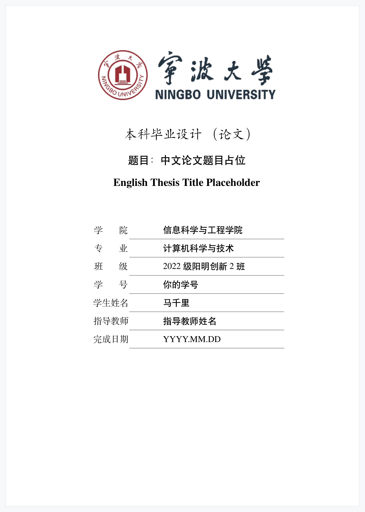
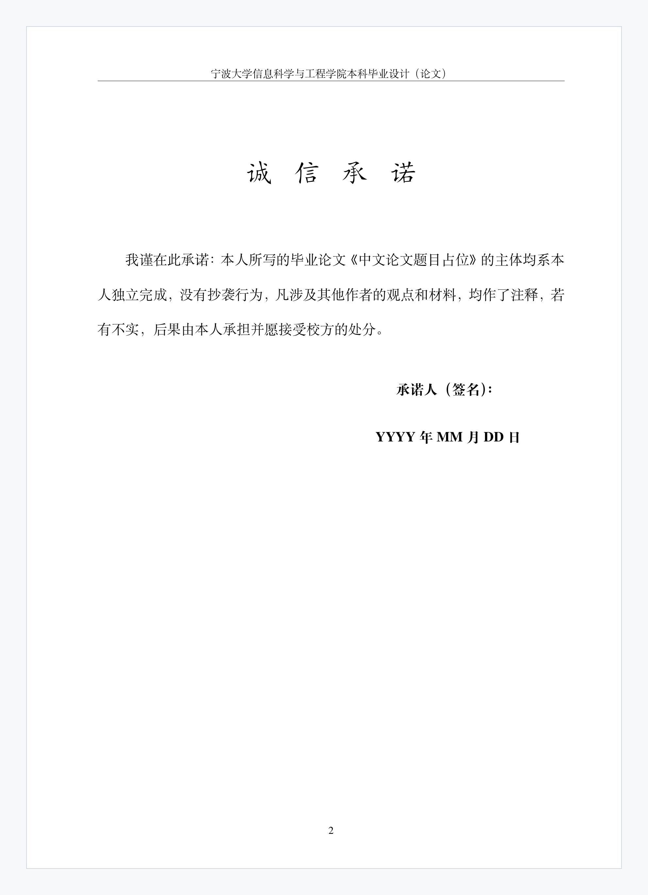
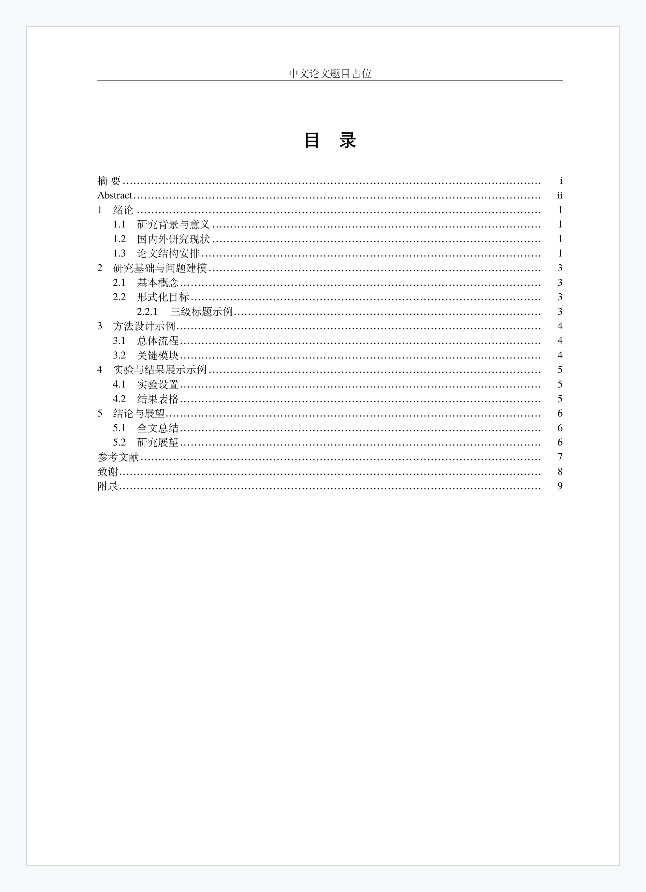
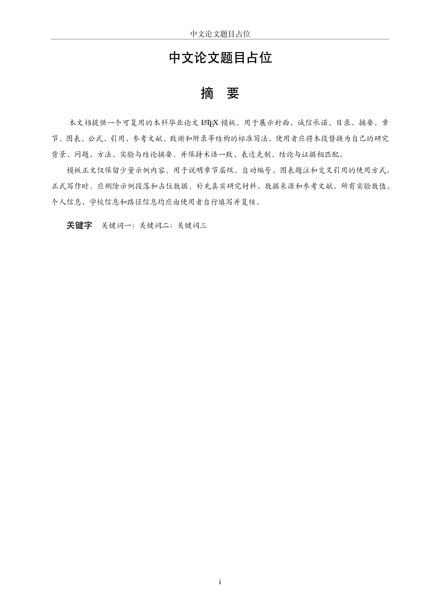
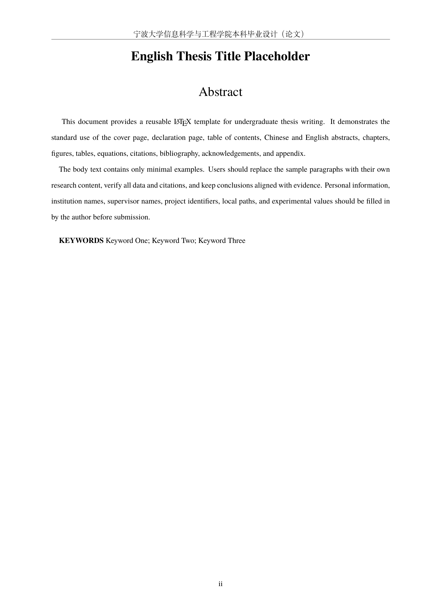

# 宁波大学本科毕业论文 LaTeX 模板

本目录是一个独立、可复用的宁波大学本科毕业论文 LaTeX 模板项目。模板从当前论文项目中抽取宁波大学封面、格式、结构和写作规范，删除了具体正文、导师信息、学号、实验数据、本机路径和账号信息，仅保留宁波大学模板信息、整理者贡献信息、可替换字段占位符与少量示例内容。

如果你第一次使用 LaTeX，建议先按“快速开始”完成一次原样编译，确认能生成 PDF 后，再替换题名、个人信息、摘要和章节正文。

## 渲染预览

以下图片由当前模板 PDF 以 220 DPI 渲染生成，用于快速查看封面、诚信承诺、目录和摘要页效果。预览图额外添加了浅灰展示底和细边框，便于在 GitHub 页面中辨认纸张边界；正式使用时，请以本地或 `Overleaf` 在线 LaTeX 平台编译得到的 PDF 为准。

当前预览已同步摘要格式修复：中英文摘要正文、中文关键词内容、英文 `KEYWORDS` 标签和英文关键词内容均按实际小四字号显示。

<p align="center">
	
</p>

<table>
	<tr>
		<td align="center"><br>诚信承诺页</td>
		<td align="center"><br>目录页</td>
	</tr>
	<tr>
		<td align="center"><br>中文摘要页</td>
		<td align="center"><br>英文摘要页</td>
	</tr>
</table>

## 快速开始

### 方式一：使用 `Overleaf` 在线 LaTeX 平台

适合不想在电脑上安装 TeX Live 的用户。

1. 打开 `https://www.overleaf.com`，登录后选择 New Project -> Upload Project。
2. 上传本模板 zip。压缩包根目录应直接包含 `main.tex`，不要再套一层外部文件夹。
3. 进入项目后，打开左侧 Settings，把 Compiler 设为 `XeLaTeX`。
4. 点击 Recompile。若目录页只显示“目 录”标题，使用 Recompile 下拉菜单中的 `Recompile from scratch`。
5. 编译完成后，检查预览中是否有封面、诚信承诺、目录、摘要、正文、参考文献、致谢和附录。

如果你拿到两个压缩包，优先在 `Overleaf` 在线平台上传精简包；完整包包含 `fonts/`，更适合本地离线使用。

### 方式二：本地使用 VS Code

适合需要长期写论文、频繁管理图片和参考文献的用户。

1. 安装 TeX Live 或 MacTeX，确保包含 `xelatex`、`latexmk` 和 `biber`。
2. 安装 Visual Studio Code。
3. 在 VS Code 扩展商店安装 LaTeX Workshop。
4. 用 VS Code 打开整个模板文件夹，不要只打开单个 `main.tex` 文件。
5. 打开 `main.tex`，使用 LaTeX Workshop 的 Build LaTeX project，或在终端运行：

```bash
latexmk -xelatex main.tex
```

生成的 PDF 位于 `build/main.pdf`。

### 方式三：本地命令行

进入模板目录后运行：

```bash
latexmk -xelatex main.tex
```

清理辅助文件时运行：

```bash
latexmk -c
```

## 文件结构

```text
nbu-bachelor-thesis-template/
├── main.tex                 # 论文入口，填写题名、作者、学院、关键词并组织章节
├── nbubachelor.cls          # 模板样式文件，控制封面、目录、标题、图表、摘要、参考文献等格式
├── frontmatter/
│   ├── abstract_zh.tex      # 中文摘要示例
│   └── abstract_en.tex      # 英文摘要示例
├── chapters/
│   ├── chapter1.tex         # 绪论示例
│   ├── chapter2.tex         # 研究基础与公式示例
│   ├── chapter3.tex         # 方法章节示例
│   ├── chapter4.tex         # 实验与表格示例
│   └── chapter5.tex         # 结论与展望示例
├── backmatter/
│   ├── acknowledgements.tex # 致谢示例文本
│   └── appendix_a.tex       # 附录占位文本
├── docs/
│   └── preview/             # README 使用的高清渲染预览图
├── fonts/                   # 完整包随附字体；`Overleaf` 精简包可能不含该目录
├── figures/                 # 图片目录，含宁波大学封面头图
│   └── nbu_cover_header.png # 宁波大学封面头图
├── tables/                  # 可复用表格片段
├── references.bib           # 示例参考文献库
├── .gitignore               # 忽略编译产物和发布压缩包
└── .latexmkrc               # latexmk 构建配置
```

## 安装与环境检查

本模板使用 XeLaTeX 编译中文论文，参考文献由 biber 处理。最少需要以下命令可用：

```bash
xelatex --version
latexmk --version
biber --version
```

如果某个命令提示 `command not found`，说明本机 TeX 环境没有装好，或安装后没有加入系统路径。macOS 用户通常安装 MacTeX；Windows 用户通常安装 TeX Live 或 MiKTeX；Linux 用户可使用系统包管理器安装 TeX Live 完整发行版。Windows 安装后如果命令仍不可用，请重启终端或 VS Code，并检查 TeX Live/MiKTeX 的 `bin` 目录是否已经加入 PATH。

## 编译方式与输出位置

推荐使用 XeLaTeX + latexmk + biber：

```bash
cd papers/nbu-bachelor-thesis-template
latexmk -xelatex main.tex
```

请不要只运行一次 `xelatex main.tex`。目录、交叉引用和参考文献依赖多轮编译；单次 XeLaTeX 首轮 PDF 可能只显示“目 录”标题而没有目录条目。

在 `Overleaf` 在线 LaTeX 平台中使用时，请在项目 Settings 中选择 `XeLaTeX` 编译器。该平台会按所选编译器执行多轮构建；如果预览只显示“目 录”标题而没有条目，使用 Recompile 下拉菜单中的 `Recompile from scratch`，并等待完整编译完成。

清理辅助文件：

```bash
latexmk -c
```

编译输出位于 `build/` 目录。不要把 `build/` 中的生成文件提交到版本库。

如果你只是想查看 PDF，打开 `build/main.pdf` 即可；不要手动编辑 `build/` 里的 `.aux`、`.toc`、`.bbl`、`.log` 等文件。

## 随附字体

完整模板在 `fonts/` 目录打包了 Fandol 中文字体、TeX Gyre Termes 英文字体和数学字体。`nbubachelor.cls` 默认优先从该目录加载字体，复制整个完整项目后通常不需要额外安装宋体、黑体、楷体或 Times New Roman。

`Overleaf` 精简包可能不包含 `fonts/`，用于降低上传体积。`Overleaf` 在线平台自带 TeX Live 和 Fandol 字体，通常仍可编译；如果你在本地使用，建议使用包含 `fonts/` 的完整包。

摘要页使用独立的中英文摘要字体配置，避免中文楷体或英文字体在 PDF 中被压缩为 10.5 pt；完整包和无 `fonts/` 的精简包均应保持摘要正文与关键词内容为实际 12 pt。

如学校后续要求改用指定字体，可替换 `fonts/` 中的字体文件，并同步修改 `nbubachelor.cls` 的字体配置。重新分发字体文件时，请遵守字体各自许可证。

## 如何使用模板

1. 复制整个目录并改名为自己的论文项目名。不要删除 `nbubachelor.cls`、`.latexmkrc`、`figures/`、`frontmatter/`、`chapters/`、`backmatter/` 和 `references.bib`。如果你使用的是完整包，也不要删除 `fonts/`。
2. 先原样编译一次，确认 `build/main.pdf` 能生成。
3. 在 `main.tex` 中保留 `\universityname{宁波大学}` 与 `\college{信息科学与工程学院}`。模板默认记录整理者贡献信息：专业为“计算机科学与技术”，班级为“2022 级阳明创新 2 班”，学生姓名为“马千里”。正式用于个人论文时，请替换 `\titlecn`、`\titleen`、`\majorname`、`\classname`、`\studentid`、`\authorname`、`\supervisor`、`\finishdate`、`\declarationdate`、`\keywordszh` 和 `\keywordsen`。
4. 在 `frontmatter/abstract_zh.tex` 和 `frontmatter/abstract_en.tex` 中重写摘要正文。
5. 在 `backmatter/acknowledgements.tex` 中将致谢示例替换为自己的真实表达。
6. 在 `chapters/` 中替换示例章节内容。新增章节时，先创建 `chapters/your_chapter.tex`，再在 `main.tex` 中添加 `\input{chapters/your_chapter}`。
7. 将图片放入 `figures/`，在正文中用 `figure` 环境和 `\includegraphics` 引用。文件名建议只使用英文、数字、短横线或下划线。
8. 将复杂表格拆到 `tables/`，在章节中用 `\input{tables/table_name}` 引入。
9. 在 `references.bib` 中维护参考文献，并在正文中用 `\cite{citation-key}` 引用。修改参考文献后请重新运行 `latexmk -xelatex main.tex`。
10. 链接脚注示例见 `chapters/chapter1.tex`，写法为 `\footnote{\href{https://github.com/Yuki-zik}{GitHub: Yuki-zik}}`。
11. 每次提交或交给老师前，重新完整编译一次，并检查目录、图表编号、参考文献和 PDF 页眉页脚。

## 第一次修改清单

新手可以按这个顺序改，不容易漏项：

1. 在 `main.tex` 中替换中文题目、英文题目、专业、班级、学号、姓名、指导教师、日期和关键词。
2. 在 `frontmatter/abstract_zh.tex` 写中文摘要。
3. 在 `frontmatter/abstract_en.tex` 写英文摘要。
4. 在 `backmatter/acknowledgements.tex` 重写致谢。
5. 从 `chapters/chapter1.tex` 开始替换正文示例。
6. 把自己的图片放入 `figures/`，把自己的表格放入 `tables/`。
7. 在 `references.bib` 中添加真实参考文献，并在正文中使用 `\cite{...}` 引用。
8. 运行 `latexmk -xelatex main.tex`，打开 `build/main.pdf` 检查结果。

## 常见问题

### 目录页只有“目 录”两个字

原因通常是只运行了一次 `xelatex`，目录文件还没有被第二轮编译读入。请运行：

```bash
latexmk -xelatex main.tex
```

`Overleaf` 用户请使用 `Recompile from scratch`。

### 报错 `fontspec requires either XeTeX or LuaTeX`

说明使用了 pdfLaTeX。请把编译器改成 `XeLaTeX`。

### 报错找不到 `biber`

说明 TeX 发行版安装不完整。请安装完整 TeX Live/MacTeX，或在 `Overleaf` 在线平台中编译。

### 参考文献不显示或引用显示问号

请确认正文中有 `\cite{...}`，并且 `references.bib` 中存在同名 citation key。修改参考文献后使用 `latexmk -xelatex main.tex`，不要手动运行单次 `xelatex`。

### 图片不显示

请确认图片文件在 `figures/` 目录中，路径大小写与 `\includegraphics{...}` 完全一致。建议图片文件名使用英文，不要使用空格。

### `Overleaf` 免费计划编译超时

完整字体包体积较大，上传和编译可能更慢。`Overleaf` 在线平台中优先使用精简包；如果仍然超时，可以先删减示例图片或在本地编译最终 PDF。

## 主要格式规范

- 页面：A4；上 2.5 cm，下 2 cm，左 2.5 cm，右 2 cm；左右边距按物理页面固定，不随奇偶页镜像互换。
- 正文：中文宋体小四，英文 Times New Roman，1.5 倍行距，段前段后 0，首行缩进 2 字符，两端对齐。
- 字体：模板随附 FandolSong、FandolHei、FandolKai 和 TeX Gyre Termes 作为宋体、黑体、楷体和 Times 兼容字体。
- 章节：一级标题居中，二级和三级标题左对齐；正文最多使用 `\chapter`、`\section`、`\subsection` 三级标题。
- 目录：自动生成，显示到三级标题；目录内容宋体五号、单倍行距，页码右对齐。
- 摘要：中文摘要和英文摘要分别使用 `\zhabstract{...}` 与 `\enabstract{...}`；关键词在 `main.tex` 中统一设置；摘要正文、关键词内容和英文 `KEYWORDS` 标签按实际小四 12 pt、固定 22 pt 行距输出。
- 图题：自动输出为 `图1-1  图题`，图号和题名之间为两个普通空格；正文使用 `图~\ref{...}` 引用。
- 表题：自动输出为 `表1-1  表题`；普通表格优先使用 `booktabs` 三线表。
- 公式：使用 LaTeX 公式环境，编号自动为 `(章节号.公式号)`；正文中使用 `式~\eqref{...}` 引用。
- 参考文献：使用 `biblatex + biber` 和 GB/T 7714 风格；正文引用与 `references.bib` 中 citation key 保持一致。

## 脱敏与替换提醒

- 模板默认保留宁波大学、信息科学与工程学院和宁波大学封面头图，因为该项目定位为宁波大学本科毕业论文模板。
- 专业、班级和学生姓名默认用于记录模板整理贡献；导师、学号、题目、日期、项目、实验数值仍为占位符或示例内容，正式使用时必须替换。
- 不要在正文、附录、图片名、参考资料或 README 中保留个人账号、绝对路径、未公开数据路径、API key、实验平台账号等敏感信息。
- 宁波大学封面头图位于 `figures/nbu_cover_header.png`；如果学校更新官方封面样式，请替换该文件并在 `main.tex` 中保持 `\coverlogofile{figures/nbu_cover_header.png}` 或改为新路径。
- 随附字体位于 `fonts/`。如果替换为学校或系统字体，不要使用本机绝对路径，应继续使用项目相对路径。
- 如果实验表格或图由数据生成，应把源数据放入纸面项目的 `data/` 目录，并保持图、表、正文数值一致。

## 写作建议

- 先确定论文结构，再填充正文，避免把 `main.tex` 写成大文件。
- 每个章节应围绕明确功能展开：问题、方法、实验或结论。
- 方法章节应说明设计动机、数学定义、实现流程和每个组件的作用。
- 实验章节应说明目标、设置、数据、指标、结果、分析和结论。
- 不要编造实验数据、参考文献或实现细节；证据不足时应明确标注需要作者确认。
